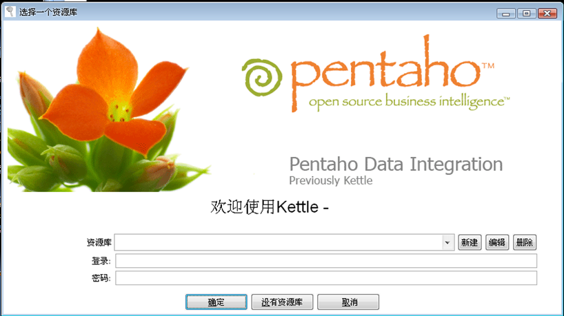

# hummingbirdSystem

### 蜂鸟数据分析平台使用Hadoop、Hive、Hbase、Kylin、Kettle、Superset等技术实现数据建模、自定义ETL操作、多维数据分析以及数据可视化的功能。

## 数据分析
### 数据分析的三重境界：
- 1.统计计数
- 2.多维分析
- 3.机器学习

### 数据分析的统计计数和多维分析，通常称之为数据探索式分析，旨在了解数据的特性，有助于进一步挖掘数据的价值。而基于对数据的理解，再引入机器学习的算法对数据做出预测就变得水到渠成了。大多数公司其实没有精力去搭建复杂的数据分析平台，面对快速变化的业务需求，很多数据工程师都把自己的青春埋葬在SQL里了。

## Kettle
### Kettle是“Kettle E.T.T.L. Envirnonment”的缩写。这意味着它被设计用来实现ETTL的需要：抽取、转换、装入和加载数据。它是一款国外开源的ETL工具，纯Java编写，可以在Window、Linux、Unix上运行，绿色无需安装，数据抽取高效稳定。

## Kylin
### Apache Kylin™是一个开源的分布式分析引擎。Kylin将OLAP分析的星型模型Schema的所有group by聚合结果存储在Hbase的表中，通过将SQL查询转化成对Hbase表的聚合操作的方式大大提高查询速度。三步实现超大数据集上的亚秒级（sub-second latency）查询：
- 1.确定Hadoop上一个星型模式的数据集
- 2.构建数据立方体（Cube）
- 3.通过ODBC、JDBC、RESTful API等接口在亚秒级的延迟内查询相关数据

### 为什么引入kylin：
- 1.数据基于Hadoop分布式存储,比MySQL的伸缩性好
- 2.提供Hadoop上超大数据规模（ 百亿行级别的数据）的亚秒级（sub-second latency）SQL查询，相对于Hive的离线分析，可做到实时查询
- 3.无缝整合其他BI工具Superset、Tableau

## Superset
### Superset是一个自助式数据分析工具，它的主要目标是简化数据探索分析操作。通过让用户创建并且分享仪表盘的方式为数据分析人员提供一个快速的数据可视化功能。通过一个定义字段、下拉聚合规则的简单的语法层操作就可以将数据源在UI上丰富地呈现，还深度整合了Druid以保证在操作超大、实时数据的分片和切分都能行云流水。
