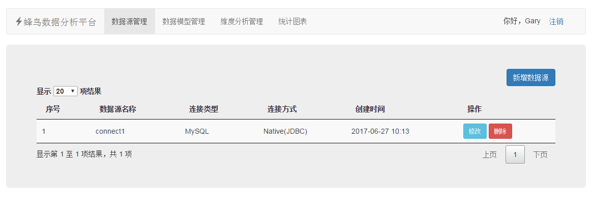
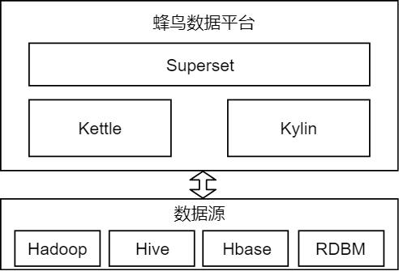

# hummingbirdSystem

### 蜂鸟数据平台使用Hadoop、Hive、Hbase、Kylin、Kettle、Superset等技术实现数据建模、自定义ETL操作、多维数据分析以及数据可视化的功能。

## 数据分析
### 数据分析的三重境界：
- 1.统计计数
- 2.多维分析
- 3.机器学习

### 数据分析的统计计数和多维分析，通常称之为数据探索式分析，旨在了解数据的特性，有助于进一步挖掘数据的价值。而基于对数据的理解，再引入机器学习的算法对数据做出预测就变得水到渠成了。大多数公司其实没有精力去搭建复杂的数据分析平台，面对快速变化的业务需求，很多数据工程师都把自己的青春埋葬在SQL里了。

## Superset
### Superset是一个自助式数据分析工具，它的主要目标是简化数据探索分析操作。通过让用户创建并且分享仪表盘的方式为数据分析人员提供一个快速的数据可视化功能。通过一个定义字段、下拉聚合规则的简单的语法层操作就可以将数据源在UI上丰富地呈现，还深度整合了Druid以保证在操作超大、实时数据的分片和切分都能行云流水。
